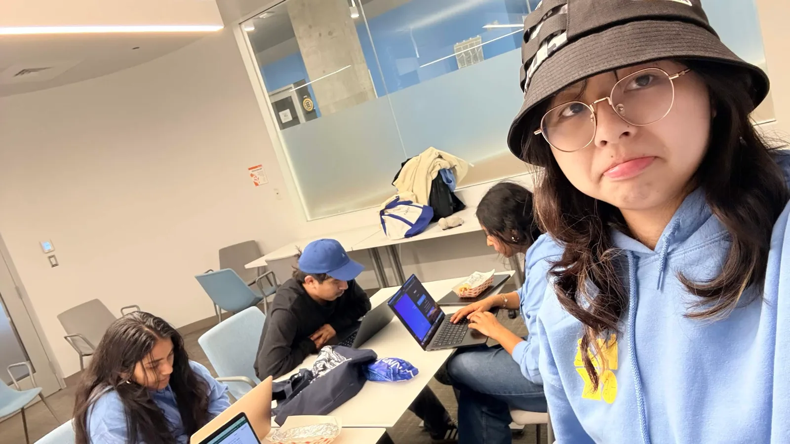
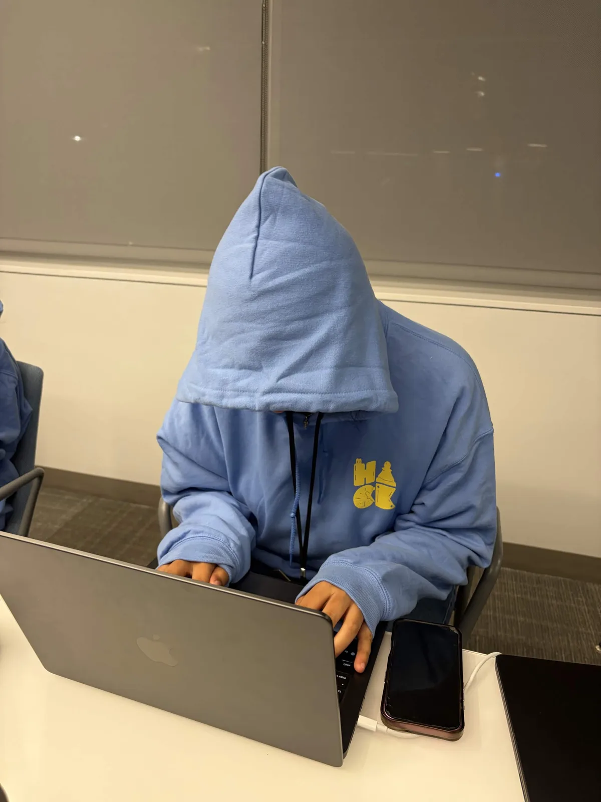
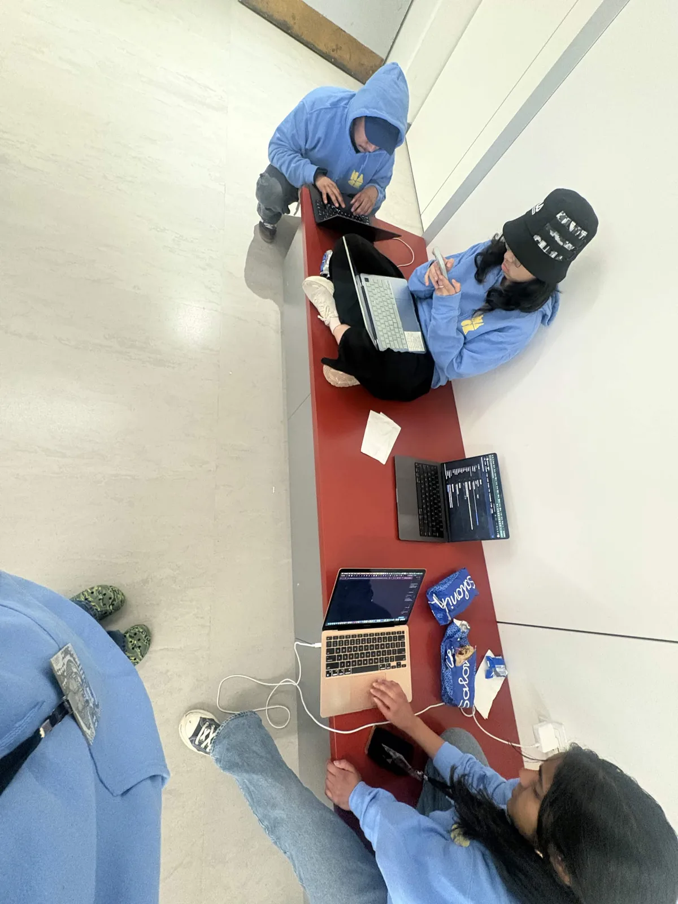

# PIXX-AR — The spatial marketplace

<!-- Replace this line with the demo video thumbnail/link when the film is ready. Keep it directly below the title. -->
**Watch the demo — coming soon.**

**Your room is the starting point. Everything it could become is the possibility.**

Built at [HackMIT 2026](https://hackmit.org/), PIXX-AR turns a room photo and an everyday request into real furniture options, previews in your space, dimension checks, and one reviewable basket across retailers.

[Explore the code](https://github.com/ygadipalli/hackmit) · [Watch our validation interviews](https://www.youtube.com/shorts/yD_aFuvd4iY) · [Run locally](#run-locally) · [Sponsor pitches](#the-challenges-we-built-for)

<p align="center">
  
  <br />
  <em>A table, four laptops, one idea.</em>
</p>

## The question

You know how you want your room to *feel*. But what do you search for?

A hundred open tabs. A sofa you love. A doorway it might not fit through. Shopping for a room means connecting inspiration, size, price, and different stores—all in your head. We thought the room itself should do more of the talking.

PIXX-AR brings those decisions into the space they are about:

| See it. | Find it. | Make it yours. |
| --- | --- | --- |
| Start with a photo and a feeling. | Discover real products that belong. | Place, compare, and review together. |

## First, we asked. Then, we built.

We asked people what makes shopping for their space harder than it should be. Those conversations shaped the product; [the interview video](https://www.youtube.com/shorts/yD_aFuvd4iY) is embedded in Room IV.

The team reports **70+ signups on the MVP**. The presentation content lives in [landing/data/pitch.ts](landing/data/pitch.ts).

## Walk through the product

1. **Enter Room III.** Open `/landing?product`, continue as a guest, or use Google sign-in when Supabase is configured.
2. **Bring your room.** Upload a room photo. The app corrects orientation and analyzes the room's palette, style, lighting, and shopping suggestions. You can edit its interpretation.
3. **Set a budget and describe an idea.** Try a request such as “a warm floor lamp for this corner.” Request normalization chooses a consistent category; the room context and remaining budget guide discovery.
4. **Explore actual listings.** Search checks the Elasticsearch catalog when configured, then uses SerpAPI shopping results as needed. It resolves retailer links and attempts to extract dimensions. Prices, product images, retailers, and dimension confidence remain visible.
5. **Place and compare.** An initial illustration gives the idea a place in the room. Selecting a listing starts background removal on that listing's actual image. Move, resize, rotate, refresh a photo, or compare another option. Failed extraction leaves a labeled illustration or the previous usable photo.
6. **Check the fit.** Calibrate photo scale with a reference object. Add doorway, turn, and headroom measurements for separate delivery-clearance checks. Missing and estimated measurements remain labeled.
7. **Review the room together.** Selected products share one basket and budget. Checkout excludes unsupported retailers, invalid retailer links, and non-USD items with an explanation before submission.
8. **Follow the checkout run.** The server freezes the basket, validates ownership and budget, and streams progress by line. Retailer fulfillment is simulated. With Visa Acceptance configured, each eligible line can receive a genuine test-card authorization in the Visa sandbox, with capture disabled.

### What is working, and what the demo means

| Capability | Current boundary |
| --- | --- |
| Room-aware discovery | Integrated Gemini analysis, optional OpenAI analysis, live shopping search, and optional Elasticsearch catalog. Provider access and network availability are required for live results. |
| Product imagery | Transparent cutouts preserve the real listing pixels. Generated concept sprites are a separate, optional preview path. |
| Spatial previews | Photo placement, scale, rotation, and measured fit checks work. A WebXR scene exists for compatible devices; a complete live AR/3D room-scanning experience remains on the roadmap. |
| Authentication | Optional Supabase Google OAuth and an explicit guest path. Checkout runs are bound to their owning browser session. |
| Visa Acceptance | Signed sandbox authorizations were verified in our own merchant portal, including a **$119.99** browser checkout. Test card; no capture; no real money moved. |
| Retailer checkout | Simulated fulfillment with `TEST-` order references. No real retailer order is submitted. |
| Trusted Agent Protocol | Real Ed25519 signing and verification against our local merchant demonstration. This does not establish adoption by the retailers whose listings appear. |
| Visa Intelligent Commerce | Separate enrollment, mandate, encryption, and credential endpoints are implemented and covered by tests. Live VIC/VTS onboarding, tokenized payment integration, and passkey consent have not been completed. |

## Key features

- **Auth & trust:** optional Google sign-in, owner-bound checkout sessions, and signed sandbox payment requests.
- **A room you can explain to the app:** editable color and style preferences, with explicit requests taking priority over inferred aesthetics.
- **Budget control:** integer-cent arithmetic, visible remaining budget, query constraints, and server validation before checkout.
- **Persistent choices:** local room state and selected items survive normal page refreshes; changing a preview does not silently change a committed selection.
- **Real product photos:** fast background extraction plus local semantic segmentation, retries, request cancellation, and versioned caching.
- **Fit with context:** independent doorway, level 90-degree turn, and headroom verdicts; unknown dimensions do not become confident approvals.
- **One basket:** review supported products across stores together, with per-line checkout status and transparent failure messages.
- **Responsive interaction:** desktop and phone layouts, keyboard-accessible dialogs, reduced-motion alternatives, and an ordinary scrollable Room IV presentation.

Fit results are rectangular-box estimates using supplied measurements, not a delivery guarantee. Listing prices, dimensions, and availability may change at the retailer.

## The challenges we built for

These are project alignments and demo narratives, not award or eligibility claims. Open the dedicated presentation with `/landing?about&sponsor=<id>`; the IDs below correspond to the six cards in Room IV.

### Visa — Reimagine Shopping (`visa`)

PIXX-AR starts where shopping should: in your room. A photo and a vague feeling become a search for real products; room-aware previews and dimensions support the decision; one basket brings the choices together. We demonstrate the payment step through signed Visa Acceptance sandbox authorizations verified in our own merchant portal.

> **Verified pipeline:** discovery → product selection → basket review → signed Visa Acceptance sandbox authorization → transaction visible in our merchant portal. The browser checkout authorized **$119.99** using a test card with capture disabled. [Open the sandbox transaction portal](https://businesscentertest.visaacceptance.com/ebc2/app/TransactionManagement/Transactions) (merchant login required). This verifies Acceptance authorization; retailer orders remain simulated, and VIC tokenization is a separate next step.

| Shopping stage | Our response |
| --- | --- |
| Discovery | Turn a room photo and a natural request into a search for real products. |
| Personalization | Use the room's palette, lighting, style, editable preferences, and budget. |
| Decision-making | Preview pieces, compare options, and inspect measurements and fit uncertainty. |
| Checkout | Coordinate the reviewed basket in one server-driven run; retailer fulfillment is simulated. |
| Payments | Verify signed Acceptance sandbox authorizations. VIC tokenization and passkey consent are next. |
| Loyalty and rewards | Planned cross-retailer offers and rewards; no rewards system is implemented. |
| Post-purchase | Fit checks surface problems before purchase. A shared order timeline, delivery updates, and returns support are planned; return reduction has not been measured. |

References: [Acceptance sandbox signup](https://developer.visaacceptance.com/hello-world/sandbox.html), [Acceptance API reference](https://developer.visaacceptance.com/api-reference-assets/index.html), [Visa Intelligent Commerce](https://developer.visa.com/capabilities/visa-intelligent-commerce/docs).

### Elastic — Find the Signal (`elastic`)

Turn scattered product results into a reusable catalog. Elasticsearch supports text retrieval and price/retailer filters; enriched shopping results can feed the catalog for the next query. The current implementation uses keyword/text search, not vector embeddings. [Elastic JavaScript client documentation](https://www.elastic.co/docs/reference/elasticsearch/clients/javascript).

### Ramp — Save Time. Save Money. (`ramp`)

Keep the room budget visible, constrain product searches, and compare the basket in one place. Room-wide budget optimization is a next step. This is a product-impact narrative; PIXX-AR does not currently call a Ramp API. [Ramp](https://ramp.com/).

### Long Lake — Convince a Non-Believer (`long-lake`)

Start with something personal: a photo of a visitor's own room. Let them describe a feeling, find a real product, and see it take shape in that space. The demonstration makes the value concrete without asking them to imagine a different workflow. [Long Lake](https://llmh.com/).

### OpenAI — OpenAI Challenge (5th Teammate) (`openai`)

OpenAI vision provides an alternate room-analysis path. Codex supported implementation, debugging, and verification, including budget-result fixes and checkout checks. The runtime OpenAI path uses `gpt-4o-mini` over HTTP; it is optional rather than the default analysis provider. [OpenAI API documentation](https://developers.openai.com/api/docs).

### Cursor / SpaceXAI — Make it Legendary with SpaceXAI (`cursor`)

**Eligibility still needs confirmation.** The track brief recorded by the team requires Cursor plus Grok Imagine or Voice API in a space-data project. The current build does not demonstrate that integration or focus. We do not claim that Grok or ElevenLabs powers this demo. [Cursor for students](https://cursor.com/students) · [SpaceXAI](https://x.ai/).

## Under the hood

The build had a few different offices. Some quieter than others.

<table>
  <tr>
    <td align="center" width="50%">
      <br />
      <em>Do not disturb. Probably debugging.</em>
    </td>
    <td align="center" width="50%">
      <br />
      <em>Our second office.</em>
    </td>
  </tr>
</table>

```text
Room photo + request + budget
  → room analysis and editable context
  → normalized category
  → catalog / live shopping discovery
  → retailer links + prices + dimensions
  → real-image cutout + room placement + fit checks
  → reviewed, frozen basket
  → owner-bound checkout run + streamed status
  → simulated retailer fulfillment / optional Visa sandbox authorization
```

| Layer | Technology and role | Status |
| --- | --- | --- |
| Application | Next.js 16.3.5, React 19.2.8, TypeScript; App Router, server routes, typed product models | Active |
| Spatial rendering | Three.js, React Three Fiber, Drei, React Three XR; custom landing shaders, room scene, device-dependent WebXR, photo fallback | Active |
| Motion and sound | GSAP, Motion, Howler, Lenis; room transitions, interface motion, ambient audio, basket scrolling | Active |
| Interface | Tailwind CSS 4, Base UI, local shadcn components, Lucide, Number Flow, Sonner, gesture handling, class variants | Active |
| State | Zustand; persisted room/budget/selection state and transient previews | Active |
| Capture | EXIF-aware image orientation and resizing with `exifr` | Active |
| Room analysis | [Gemini API](https://ai.google.dev/gemini-api/docs) via `@google/genai`; structured palette, style, lighting, suggestions | Configuration dependent |
| Alternate analysis | [OpenAI HTTP API](https://developers.openai.com/api/docs); `gpt-4o-mini` | Optional |
| Request normalization | Deterministic category/rules mapping | Active; no model call |
| Product discovery | [SerpAPI Google Shopping](https://serpapi.com/google-shopping-api), seller-link resolution, relevance filtering, dimension extraction | Configuration dependent |
| Catalog | [Elasticsearch](https://www.elastic.co/docs/reference/elasticsearch/clients/javascript); text search, retailer/price filters, enrichment reuse | Optional |
| Product cutouts | Sharp, ONNX Runtime, BiRefNet-Lite 512 and U²-Net; masks applied to original listing pixels | Local CPU inference |
| Concept previews | [Higgsfield](https://higgsfield.ai/) CLI, with curated silhouettes when unavailable | Optional |
| Fit | Photo scale reference and deterministic geometry for door, corner, and headroom checks | Active; estimates labeled |
| Authentication | [Supabase Google OAuth](https://supabase.com/docs/guides/auth/social-login/auth-google), SSR cookies, guest flow | Optional OAuth |
| Checkout | Validated immutable basket snapshot, owner cookie, per-process run store, server-sent events | Active; fulfillment simulated |
| Agent signatures | Node crypto, Ed25519, short validity window, domain/path/operation binding, local registry and merchant verifier | Local TAP demonstration |
| Payment authorization | Visa Acceptance HTTP HMAC signatures and body digest | Sandbox verified |
| VIC scaffolding | X-Pay token construction and `jose` JWE/MLE; enrollment/mandate/credential routes | Separate onboarding required |
| Image transport | Public-address checks, validated DNS pinning, redirect rechecks, size and time limits | Active |
| Engineering | Vitest, ESLint, TypeScript, PostCSS, Tailwind tooling, shadcn component generation | Development |
| Hosting | Vercel is the intended deployment target; the demonstrated build runs locally | Deployment not verified |

The complete versioned package list is in [package.json](package.json), with resolved versions in [package-lock.json](package-lock.json). [pitchStack.ts](landing/data/pitchStack.ts) contains the categorized inventory and the searchable table shown in Room IV.

Installed packages not currently imported by the application are Clerk, Google model-viewer, Embla, `framer-motion` (the app imports `motion`), Konva, React Konva, MongoDB, and React Modal Sheet. Installation alone is not an active integration. ElevenLabs and xAI/Grok have no implemented client/API path in the current app. Codex is a development tool, not a runtime dependency.

### Runtime details that matter

- **Analysis:** the source currently defaults to `gemini-3.1-flash-lite`, with configurable Gemini fallbacks. OpenAI is attempted when Gemini is absent or returns no usable context; a thrown Gemini failure currently returns labeled neutral context. Model names and access can change, so check your provider account and configure the model variables for your deployment.
- **Search:** catalog reuse does not guarantee complete retailer coverage. Live discovery needs provider access; dimension scrapes can fail or yield estimates. The UI preserves those distinctions.
- **Cutouts:** ONNX Runtime is a Node server dependency, externalized in `next.config.ts`. The current primary artifact is the checksum-pinned BiRefNet-Lite **512** export, approximately 192 MB, cached at `.placeholder-cache/models/birefnet-lite-512.onnx`. U²-Net is a separate fallback artifact. Models download on demand and run locally on CPU; no inference API key is needed. Clear packshots are more reliable than collages or cropped lifestyle photos.
- **Cold starts:** pre-provision the model files before a timed or offline demo. `CUTOUT_MODEL_PATH` must point to the verified 512 export, not the older 1024 model. `PLACEHOLDER_CACHE_DIR` must be writable. The client currently allows 30 seconds for extraction; a first download can exceed that. See [the implementation](lib/productSegmentation.ts), [BiRefNet license](docs/licenses/BiRefNet.txt), and [U²-Net license](docs/licenses/U-2-Net.txt).
- **Previews:** optional Higgsfield generation needs an installed, authenticated CLI. A bounded process call, disk cache, and curated silhouette fallback handle unavailable generation. It does not generate a replacement for a selected retailer product photo.
- **Persistence:** room state uses local storage. Checkout runs use an in-memory, per-process store; they are not durable across process restarts or shared across serverless instances. Persistent storage and multi-instance coordination remain deployment work.
- **Trust:** session ownership and signature checks protect the demonstrated flow, but this is not a production commerce platform. The local TAP verifier has no persistent seen-nonce replay database; do not present it as complete replay protection.

## Run locally

Use **Node.js 24** and npm. Next.js and Sharp require at least Node 20.9, but the Elasticsearch client requires Node 22+, and the installed Vitest 5 declares Node `^22.12.0 || ^24.0.0 || >=26.0.0`. Node 24 supports the complete current development toolchain.

```bash
git clone https://github.com/ygadipalli/hackmit.git
cd hackmit
npm ci
cp env.example .env.local
npm run dev
```

Fill in the relevant variables in the ignored `.env.local` before starting the live integrations. This README lists **names only**, never credentials.

| Capability | Environment variable names | Needed for |
| --- | --- | --- |
| Live shopping | `SERPAPI_KEY` | Fresh shopping results |
| Gemini analysis | `GEMINI_API_KEY`, `GEMINI_MODEL`, `GEMINI_FALLBACK_MODELS` | Photo analysis and model selection |
| OpenAI analysis | `OPENAI_API_KEY` | Optional alternate photo analysis |
| Elasticsearch | `ELASTICSEARCH_URL`, `ELASTICSEARCH_API_KEY` | Optional product catalog |
| Search tuning | `SERPAPI_TIMEOUT_MS`, `SERPAPI_IMMERSIVE_TIMEOUT_MS`, `SERPAPI_MAX_IMMERSIVE`, `SEARCH_BUDGET_MS`, `SEARCH_STYLED_WAIT_MS` | Optional request limits |
| Alternate search endpoint | `SEARCH_API_URL`, `NEXT_PUBLIC_SEARCH_API_URL` | Optional custom search adapter; the public variant is browser-visible |
| Concept sprites | `HIGGSFIELD_BIN`, `PLACEHOLDER_MODEL`, `PLACEHOLDER_QUALITY`, `PLACEHOLDER_TIMEOUT_MS`, `PLACEHOLDER_DISABLE_GENERATION` | Optional authenticated CLI generation |
| Image/model cache | `PLACEHOLDER_CACHE_DIR`, `CUTOUT_MODEL_PATH` | Writable cache and optional pre-provisioned 512 model |
| Google sign-in | `NEXT_PUBLIC_SUPABASE_URL`, `NEXT_PUBLIC_SUPABASE_ANON_KEY` | Optional Google OAuth; enable the provider and allow your origin's `/auth/callback` |
| Checkout behavior | `CHECKOUT_MODE`, `ENABLE_REAL_ORDERS`, `PAYMENT_PROVIDER` | Keep checkout in test mode and real ordering disabled; choose simulated payment or Acceptance sandbox |
| Acceptance sandbox | `VA_MERCHANT_ID`, `VA_MERCHANT_KEY_ID`, `VA_MERCHANT_SECRET_KEY`, `VA_RUN_ENVIRONMENT` | Your sandbox merchant and REST shared-secret key pair |
| Live payment tests | `VA_LIVE_TEST` | Explicit opt-in to sandbox network tests |
| Local TAP | `TAP_AGENT_ID`, `TAP_KEY_ID`, `TAP_ED25519_PRIVATE_KEY`, `TAP_ED25519_PUBLIC_KEY`, `TAP_VERIFY_BASE_URL` | Optional agent signing and local merchant verification |
| VIC configuration | `VISA_API_BASE_URL`, `VISA_VIC_API_KEY`, `VISA_VIC_API_KEY_SS`, `VISA_EXTERNAL_CLIENT_ID`, `VISA_EXTERNAL_APP_ID`, `VISA_MLE_SERVER_CERT`, `VISA_MLE_PRIVATE_KEY`, `VISA_KEY_ID`, `VISA_CONSUMER_ID` | Separate Visa Intelligent Commerce onboarding |
| Token enrollment reference | `VISA_ENROLLMENT_REFERENCE_ID` | Tokenized-card reference required by the VIC workflow |
| Reserved VTS template fields | `VISA_VTS_API_BASE_URL`, `VISA_VTS_API_KEY`, `VISA_VTS_API_KEY_SS` | Present in the template; no direct VTS HTTP client consumes these yet |
| Local development | `DEV_ORIGIN` | Optional additional allowed dev origin for a phone on the LAN |
| Legacy display flag | `NEXT_PUBLIC_VISA_REAL_ORDERS` | Legacy copy only; does not enable real ordering |

`env.example` provides a starting configuration. Add only the optional integrations you use; keep secret values in your local or deployment environment.

### Open the experience

| Local URL | Purpose |
| --- | --- |
| [http://localhost:3000/landing](http://localhost:3000/landing) | Room-based landing experience; `/` redirects here |
| [http://localhost:3000/landing?product](http://localhost:3000/landing?product) | Room III product studio |
| [http://localhost:3000/landing?about](http://localhost:3000/landing?about) | Room IV story, validation, stack, features, roadmap, and sponsor presentations |
| [http://localhost:3000/landing?about&sponsor=visa](http://localhost:3000/landing?about&sponsor=visa) | Direct Visa presentation card |
| [http://localhost:3000/?standalone=1](http://localhost:3000/?standalone=1) | Standalone capture path when the landing's WebGL stage is unsuitable |

For live-flow verification, explicitly disable seeded demo mode with the `demo=0` query parameter. Guest access needs no OAuth credentials. Without an analysis key the app returns labeled neutral context; fresh shopping still requires SerpAPI or a configured alternative/catalog path.

### Configure the sandbox payment demonstration

Create a [Visa Acceptance sandbox account](https://developer.visaacceptance.com/hello-world/sandbox.html), generate a REST shared-secret key pair, and put your merchant variables in `.env.local`. The implementation accepts only the Visa Acceptance/Cybersource test hosts. Select the Acceptance payment provider while keeping checkout in test mode and real ordering disabled. Restart the development server after environment changes.

For optional TAP signing, `npm run keys:tap` prints a new local key pair and a public registry entry. Keep the private portion in `.env.local`; add only the public entry under `keys` in [data/tap-registry.json](data/tap-registry.json). Do not commit key output. Acceptance authorization works independently of live VIC onboarding.

The Acceptance signup does **not** grant VIC/VTS access. The application does not currently use Visa's MCP server, and its retrieved VIC credential is not wired into the Acceptance test-card authorization path.

## API map

All routes are implemented in this repository. “Built” describes the code path; provider-backed routes still require configuration. Checkout reads and mutations enforce run ownership where applicable.

| Method | Route / source | Responsibility |
| --- | --- | --- |
| POST | [`/api/analyze`](app/api/analyze/route.ts) | Room photo → structured context or labeled neutral fallback |
| GET, POST | [`/api/normalise`](app/api/normalise/route.ts) | Natural request → category and normalized request |
| GET, POST | [`/api/placeholder`](app/api/placeholder/route.ts) | Generate/serve cached concept sprites; silhouette fallback |
| POST | [`/api/cutout`](app/api/cutout/route.ts) | Actual listing image → transparent cutout |
| POST | [`/api/source`](app/api/source/route.ts) | Source and enrich products, optionally grouped by room suggestion |
| POST | [`/api/search`](app/api/search/route.ts) | Studio matches using request, room context, and remaining budget |
| GET | [`/api/products/search`](app/api/products/search/route.ts) | Elasticsearch catalog query and filters |
| POST | [`/api/fit`](app/api/fit/route.ts) | Doorway, corner, and headroom checks |
| POST | [`/api/checkout`](app/api/checkout/route.ts) | Validate basket and start owner-bound checkout run |
| GET | [`/api/checkout/[runId]`](app/api/checkout/[runId]/route.ts) | Read owned checkout snapshot |
| GET | [`/api/checkout/[runId]/stream`](app/api/checkout/[runId]/stream/route.ts) | Per-line server-sent progress |
| POST | [`/api/payments/authorize`](app/api/payments/authorize/route.ts) | Signed Visa Acceptance test authorization; capture disabled |
| GET, POST | [`/api/tap/demo`](app/api/tap/demo/route.ts) | Local agent signature and tamper demonstration |
| POST | [`/api/retailer/[retailer]/verify`](app/api/retailer/[retailer]/verify/route.ts) | Our merchant-side signature verifier |
| GET | [`/api/visa/health`](app/api/visa/health/route.ts) | VIC configuration and authenticated diagnostic probe |
| POST | [`/api/visa/enroll`](app/api/visa/enroll/route.ts) | VIC tokenized-card enrollment; onboarding required |
| POST | [`/api/visa/mandate`](app/api/visa/mandate/route.ts) | Create a purchase instruction bound to a checkout run |
| PUT | [`/api/visa/mandate/[instructionId]/cancel`](app/api/visa/mandate/[instructionId]/cancel/route.ts) | Cancel an owned instruction |
| POST | [`/api/visa/credentials`](app/api/visa/credentials/route.ts) | Request a payment credential without returning the full credential to the browser |
| POST | [`/api/visa/confirm`](app/api/visa/confirm/route.ts) | Submit a purchase outcome only with matching payment evidence |

The separate [`/auth/callback`](app/auth/callback/route.ts) route completes Supabase OAuth. VIC endpoints return explicit configuration/onboarding failures rather than fabricated instruction or token identifiers.

## Verification

```bash
npm test
npx tsc --noEmit
npm run lint
npm run build
```

Run the production server after a successful build with `npm start`. The default Vitest suite skips the three external Visa authorization tests. To run those tests deliberately, load your local environment into the test process, enable the `VA_LIVE_TEST` opt-in, and run:

```bash
npx vitest run lib/visaAcceptance/live.test.ts
```

Vitest does not automatically inherit Next's `.env.local` loading. Supply those variables through your local test environment without printing them. The live suite verifies a valid authorization, rejection of a body changed after signing, and rejection of an incorrect signing secret. It uses published test-card data and never captures a payment.

Focused regression areas include search relevance and budget changes, stale responses, currency/retailer validation, image decoding and extraction, remote image safety, fit geometry, basket ownership, TAP tampering, and payment signatures. Browser verification covers the room upload → search → selection → review → streamed checkout journey on desktop and phone layouts.

See [PRODUCT_E2E_VERIFICATION.md](docs/PRODUCT_E2E_VERIFICATION.md) for the chronological browser/regression record. Earlier entries describe older implementations and configuration; later sections supersede them. The current runtime notes above describe the current cutout model and sandbox boundary. [DEMO_SCRIPT.md](docs/DEMO_SCRIPT.md) provides a concise payment demonstration and tamper-check commands.

## Next: AR and 3D spaces

**Live AR:** move around a room and preview furniture through the phone's camera, building on the existing WebXR scene and photo fallback.

**3D room models:** turn a room scan into an editable spatial model, arrange furniture, and compare layouts. Room reconstruction and full 3D model generation are future work.

The commerce roadmap includes VIC/VTS tokenization and passkey consent, persistent checkout storage, production merchant integrations, room-wide budget optimization, rewards, and a shared post-purchase timeline. These are next steps, not capabilities of the current demo.

## The people behind the pixels

| Teammate | Contributions |
| --- | --- |
| Arshiya Sharma | Room intelligence, Gemini/Higgsfield workflows, product discovery, and the PIXX-AR identity |
| Jose Cruz-Lopez | Frontend and spatial experience, placement, previews, fit visualization, motion design, search, and room analysis |
| Yashasree Gadipalli | Application architecture, authentication, basket and checkout orchestration, budget safeguards, caching, and verification |
| Yutian Gong | Early sourcing and retailer-page scraping, search performance, AR workflow, and Google authentication |

<table>
  <tr>
    <td align="center" width="35%">
      <br />
      <em>The people behind the pixels.</em>
    </td>
    <td align="center" width="65%">
      <br />
      <em>And the people we met along the way.</em>
    </td>
  </tr>
</table>

[More from our HackMIT weekend](public/assets/about/photos).

## Thank you, HackMIT

To the judges, organizers, mentors, volunteers, and everyone who stopped to share an idea: this room is better because you were in it.

Made with curiosity, in Cambridge. HackMIT illustrations were supplied by the team; sponsor marks belong to their respective owners. Third-party model licenses are retained in [docs/licenses](docs/licenses).
